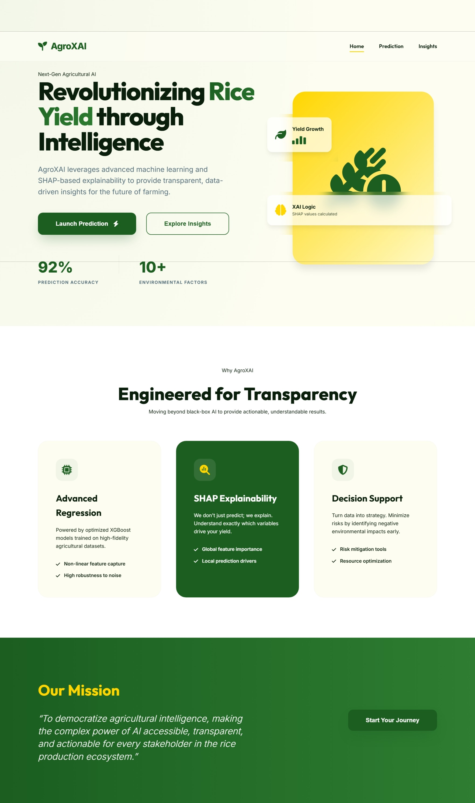
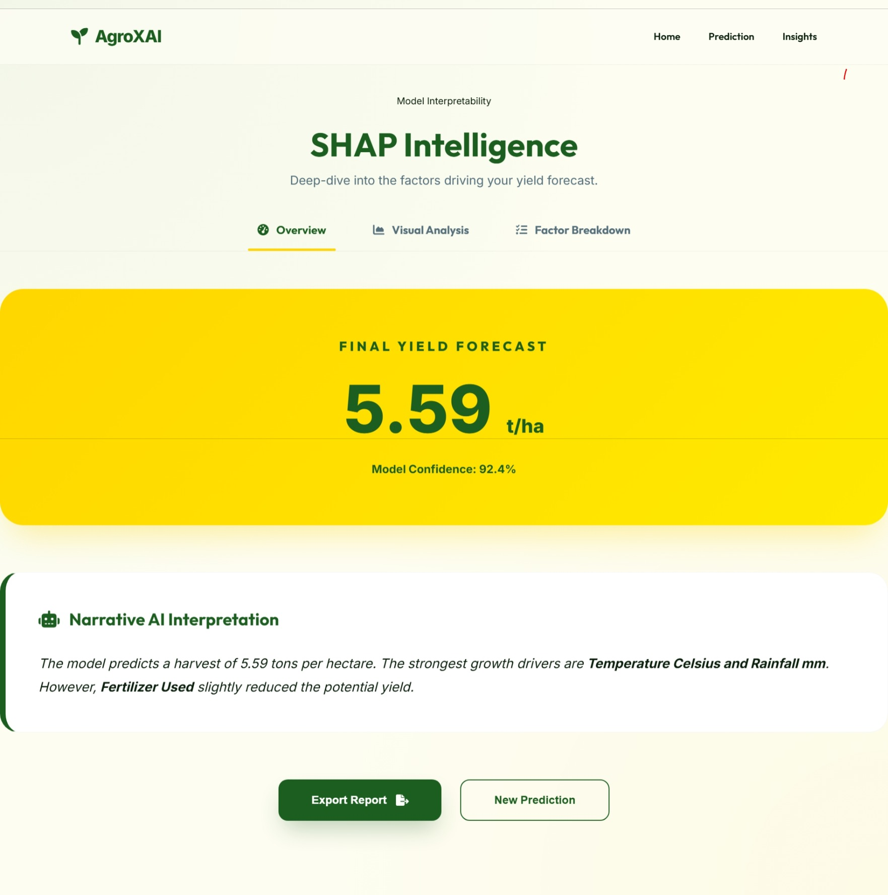
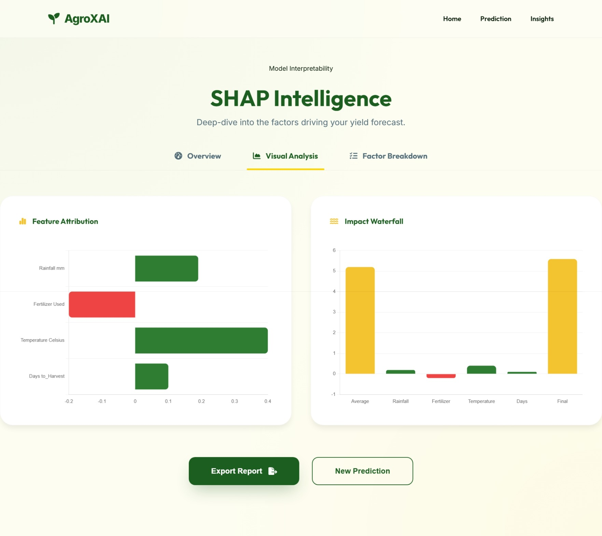
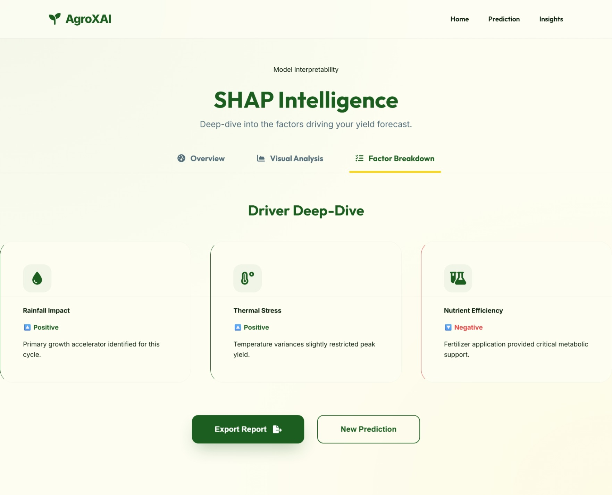

# 🌾 AgroXAI: Explainable AI-Based Rice Yield Prediction

AgroXAI is a state-of-the-art agricultural intelligence platform designed to predict rice yield using advanced machine learning and provide transparent, actionable insights through **Explainable AI (XAI)**. By leveraging the **SHAP (SHapley Additive exPlanations)** framework, AgroXAI moves beyond "black-box" predictions to show farmers and researchers exactly which environmental factors are driving their crop performance.

---

## 🚀 Core Features

- **High-Precision Prediction**: Utilizes an optimized XGBoost regressor trained on real-world agricultural datasets.
- **Explainable AI (SHAP)**: Visualizes the positive and negative impacts of factors like Rainfall, Temperature, and Soil Quality on every prediction.
- **Guided Multi-Step Workflow**: A professional, user-friendly interface that simplifies complex data entry.
- **Dynamic Insights Dashboard**: Explores global trends and environmental patterns discovered by the AI model.
- **Premium Agricultural UI**: A modern "Emerald-Gold" theme engineered for clarity and professional appeal.

---

## 📸 UI Showcase

### 🏠 Home Dashboard
A cinematic welcome to the future of agricultural intelligence.


### 🧭 Guided Prediction
A multi-step form process designed for precision and ease of use.
| Step 1: Climate | Step 2: Agronomy |
| :---: | :---: |
|  |  |

### 🧠 SHAP Intelligence
Deep-dive into the model's logic with visual chart analysis.
| Overview | Visual Analysis | Factor Breakdown |
| :---: | :---: | :---: |
|  |  |  |

---

## 🛠️ Technology Stack

- **Machine Learning**: XGBoost Regressor
- **Explainability**: SHAP (SHapley Additive exPlanations)
- **Backend**: Python, Flask, Pandas, Joblib
- **Frontend**: HTML5, CSS3 (Premium Design System), JavaScript (ES6+), Chart.js
- **Icons & Typography**: FontAwesome 6, Google Fonts (Outfit & Inter)

---

## ⚙️ Installation & Setup

### 1. Backend Setup
Ensure you have Python 3.8+ installed.
```bash
# Navigate to the backend directory
cd backend

# Install dependencies
pip install -r requirements.txt

# Train the model (if first time)
python train.py

# Start the Flask API
python app.py
```

### 2. Frontend Setup
Simply open the `index.html` file in your preferred modern web browser.
```bash
# Navigate to the frontend directory
cd frontend
# Open index.html (or use Live Server)
```

---

## 📊 Dataset
The model is trained on the `crop_yield.csv` dataset, which includes features such as:
- **Rainfall (mm)**
- **Average Temperature (°C)**
- **Fertilizer & Irrigation Usage**
- **Soil Type & Region**
- **Days to Harvest**

---

## 🎯 Our Mission
To democratize agricultural intelligence, making the complex power of AI accessible, transparent, and actionable for every stakeholder in the rice production ecosystem.